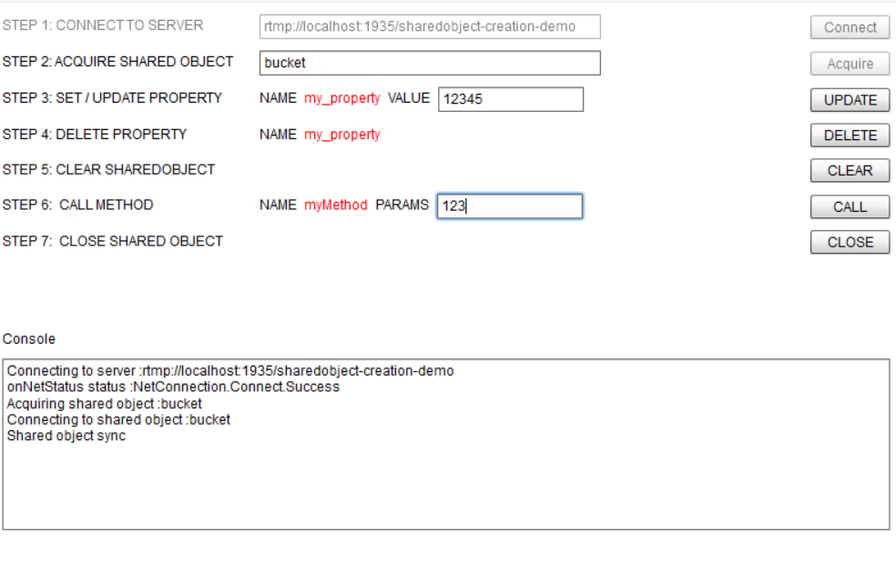

# SharedObject event listener demo
---

## About
---


This example demonstrates how to create a SharedObject on server side and then observe it using a [SharedObject listener](#http://red5.org/javadoc/red5-server-common/org/red5/server/api/so/ISharedObjectListener.html) for important events such as client connect, client disconnect, update, clear and close events.

## Build & Deploy
---

### Build
---

To build this application : open a shell prompt in the application's project directory (where the pom.xml file resides). run the following maven command in your shell -> 

``` 
mvn clean package 

```

The above command will generate a `war` file in the `target` directory inside the project directory. 


### Deploy
---

To deploy the war to red5 / red5 pro server :

1. Stop server if it is running.

2. Extract the content of the `war file` to directory by war name. 

> The java war file is simply a `archive file` similar to `zip` format. you can extract it using a archive tool such as [7zip](#http://www.7-zip.org/), [Winrar trial](#http://www.rarlab.com/download.htm) etc

3. Copy the folder into `RED5_HOME/webapps/` directory.

4. Start server.


## How To Use Example
---

Once the application has been deployed to the server, navigate to `http://localhost:5080/sharedobject-listener-demo` to launch the sample flash client. Interact with the client interface following the labeled `Steps`, while keeping the `console` running in another window.
You can observe the server side callbacks triggering as you interact with the client interface. Thsi wil help you better understand the flow of events and use of the [ISharedObjectListener](http://red5.org/javadoc/red5-server-common/org/red5/server/api/so/ISharedObjectListener.html) interface.





## Eclipse
---

You can edit the server side code in your eclipse JEE IDE such as Luna, Mars, Neon etc. To import the code into your IDE:

1. Navigate to the repository folder
2. Execute maven command `mvn eclipse:eclipse`. This will generate files necessary for eclipse to read the maven project properly.
3. In eclipse go to `File -> Import -> Existing Maven Projects` and click `Next`.
4. Browse and select `the project root` and Click `Finish` to import the project.


## Additional Notes
---

The source for the client side example is available at [https://github.com/rajdeeprath/red5-development-series/tree/master/code-examples/client-side/red5-sharedobjects-demo/sharedobject-listener-demo](https://github.com/rajdeeprath/red5-development-series/tree/master/code-examples/client-side/red5-sharedobjects-demo/sharedobject-listener-demo)


