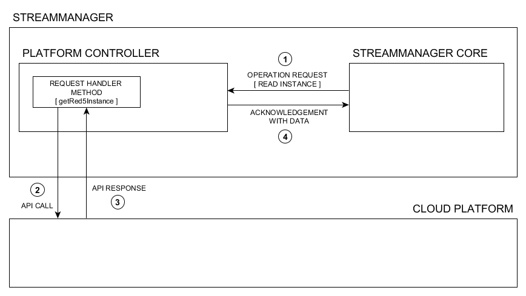
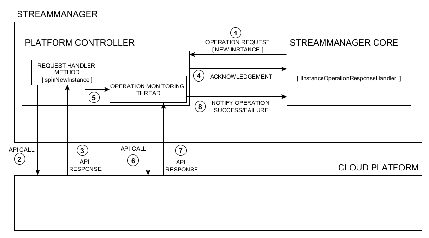

* [Introduction](#introduction)
  * [What is a Controller](#what-is-a-controller)
  * [Overview](#overview)
* [Stream Manager Node States](#stream-manager-node-states)
* [Controller - Stream Manager Communication](#controller---stream-manager-communication)
* [Controller Operations](#controller-operations)
  * [Synchronous Operations](#synchronous-operations)
  * [Asynchronous Operations](#asynchronous-operations)
* [Developing Your Own Controller](#developing-your-own-controller)
  * [Pre-Development Checklist](#pre-development-checklist)
  * [Know Your Platform](#know-your-platform)
  * [Streammanager-Commons Dependency](#streammanager-commons-dependency)
    * [Adding Dependency via Maven](#adding-dependency-via-maven)
    * [Manually Provisioning the Dependency](#manually-provisioning-the-dependency)
  * [Starting a Controller Project](#starting-a-controller-project)
    * [Getting Started](#getting-started)
    * [Renaming the Template Project](#renaming-the-template-project)
    * [Adding Platform SDK Libraries](#adding-platform-sdk-libraries)
    * [Coding Controller Methods](#coding-controller-methods)
    * [Exposing Configuration Parameters](#exposing-configuration-parameters)
* [Building the Controller JAR](#building-the-controller-jar)
* [Deploying the Controller](#deploying-the-controller)
* [Testing / Debugging the Controller Code](#testing--debugging-the-controller-code)
* [Final Notes](#final-notes)

# Introduction

## What is a Controller

The primary responsibilities of the Stream Manager software is to manage instances remotely to be able to provide  streaming services to clients. These instances are either cloud based or `managed` instances. Cloud based instances are managed on their respective cloud platforms
via the official platform API.

Stream Manager may only know `what` must be done with an instance at any given time. It does not however `know` how to do that. The `how` part of instance management involves using the instance management `API` to communicate the requests to the target platform.

The component which is responsible for talking to the target platform's API layer to make instance operation requests is called the `platform controller`.The `controller` makes instance requests on behalf of the Stream Manager and conveys responses back to the Stream Manager `core` through a streamlined communication mechanism.

This makes the Stream Manager modular and allows developers to connect Stream Manager to any cloud platform.

## Overview

Platform `controllers` are developed in Java and managed as `maven` projects which makes it very easy to include platform SDK and other dependencies.

The `controller''s`is defined by a Java class which is treated as a Java bean in our development context. The class implements the standard `controller` interface to be treated as a `Stream Manager platform controller`. Besides having all the interface forced methods and custom ones, the controller class exposes configurable properties via  getter and setter methods. These methods are used to configure the controller. For example you might want to set platform credentials or API keys that are needed by your controller to talk to the platform.

`Maven` helps in building a single fat controller `jar` file which includes any necessary dependencies as well. You must understand `maven`based development flow to be able to develop your own controller. Most standard platforms support `maven` and `gradle` as dependency management systems to help you include their SDKs into your java project.

At the moment we support only maven based dependency management for `controller` development.

Once the controller jar is built it must be deployed and configured alongside Stream Manager web application, to be detected and recognized as a valid `controller` object. Red5 Pro is heavily built around the JEE architecture and uses the spring framework inside out.

In a standard JEE web application Java classes are treated as java beans. and can be instantiated by including the correct bean markup in the application's `context` file . The context file for Stream Manager web application is the `applicationContext.xml` file.

The platform controller is configured to work with Stream Manager in three simple steps  steps:

1. Drop the controller jar into the `streammanager` webapp's `lib` directory, located at : `{RED5_HOME/webapps/streammanager/WEB-INF/lib`. This way Stream Manager can find the necessary classes in run-time.
2. Enable the controller through stream manager's configuration file -  `applicationContext.xml file`. The controller should be instantiated through a JEE bean entity. This allows Stream Manager to register and use the loaded `controller` class. It is important to note that the bean `id` attribute is always `apiBridge` and the class attribute points to the `controller` class.

  Example: Google compute controller registration

  ```xml
  <bean id="apiBridge" class="com.red5pro.services.cloud.google.component.ComputeInstanceController" init-method="initialize">
     <property name="project" value="${compute.project}"/>
     <property name="defaultZone" value="${compute.defaultzone}"/>
     <property name="defaultDiskType" value="${compute.defaultdisk}"/>
     <property name="operationTimeoutMilliseconds" value="${compute.operationTimeoutMilliseconds}"/>
  </bean>
  ```

  The bean `property` entities are the configurable attributes in the controller that are exposed via getter and setter methods. The values for the bean properties. The `value`attribute for these `property` entities are fulfilles from the `streammanager` web application's `red5-web.properties` file.

3. Configure the controller properties via `streammanager` web application's `red5-web.properties` file, located at `RED5_HOME/webapps/streammanager/WEB-INF/red5-web.properties`.  The properties and their values are defined here and are automatically substituted in the `applicationContext.xml` file when the application runs.

  Example: Google compute controller configuration

  ```sh
  ## GOOGLE COMPUTE CLOUD CONTROLLER CONFIGURATION ##
  compute.project=red-five-cove-131112016
  compute.defaultzone=asia-east1-a
  compute.defaultdisk=pd-standard
  compute.operationTimeoutMilliseconds=120000
  ```

After the configuration steps are complete you would normally start the Stream Manager server. The web application will then load and initialize the `controller` object and connect it to the Stream Manager core. The logging will indicate whether the controller initialized successfully or there was an error.

**NOTE: We will be looking at details of the development process in the coming sections.**

# Stream Manager Node States

Before diving further into this guide, it is important to understand the different node states that are understood and managed by Stream Manager.

The Stream Manager system defines discrete node states that define the operational status of a Red5 Pro Instance. Each cloud platform such as AWS or Google compute or even the simulated cloud platform defines its own set of node states. A controller understands the node states specific to the platform that it is operating on and translates then to Stream Manager recognized node states each time that a instance is being read in by the Stream Manager `core`.


Stream Manager defines Red5 Pro instances by the following states:

* **PENDING** : A node is said to be in a `pending` state when it is being created / provisioned. Every new node is in a `pending` state as it undergoes initialization. The initialization state on the target platform may consist of resource allocations and other VM creation steps. On the other hand, simulated cloud instances are already resource ready and are just waiting to be inducted.

* **RUNNING** : Once an instance has finished initialization and has all the resource it needs it is said to be in a `RUNNING` state. A `running` state does not mean that the Red5 Pro service is accessible. It only means that the VM / hardware machine is up and running.

* **INSERVICE** : The `inservice` state corresponds to a confirmed availability and reachability of the Red5 Pro service on the instance. In other words this means the Red5 Pro server is running and the instance is ready for use.

* **UNRESPONSIVE** : This is a temporary state of a node when it fails to ping Stream Manager. Every node pings Stream Manager  as per the `Autoscale` plugin configuration. The  `Red5CloudWatch` component of the Stream Manager expects a regular ping from the node to indicate that it is `inservice`. When a node fails to ping within the expected time it is initially marked as `unresponsive`. If it continues to stay in that state by the next expected ping interval as well, it is set for `termination`. If the node does ping back in the next interval the state is changed from `unresponsive` to `inservice`.

* **TERMINATING** : When a instance fails or needs to be scaled down due to over capacity, Stream Manager requests the controller to terminate it on the platform. The instance state is then set to `terminating` just before request for actual termination is made.

* **DISPOSED** :  The final state of a node life-cycle is when the instance has been stopped or terminated on the platform. Although it is not a state to be persisted in the data store, it is marked as the state for clear depiction. The node is then removed from the Stream Manager data store.

# Controller - Stream Manager Communication

A controller typically receives instance `CUD` (create, update, delete) requests from the Stream Manager `core`. the Stream Manager does not know or care about which platform the controller targets. It merely knows that there is a controller present in the system to be used. Stream Manager recognizes a valid controller as an object that implements the `ICloudPlatformInstanceController` interface.

Stream Manager invokes instance operation methods declared on the interface. The controller must then make a API request to the platform to authenticate and request the instance operation. If the operation is API call succeeds we acknowledge the Stream Manager core by returning an expected `response`. If the API call fails the controller must throw an exception for Stream Manager core to handle.

Most instance operations are asynchronous in nature (except for the read instance operation). When an instance operation is performed, the instance state changes from one state to another state, possibly through a few intermediate ones. An operation can only be concluded once the instance has reached the intended state without any errors.

Once the API call has succeeded, the controller acknowledges Stream Manager core with a `response` and starts a parallel thread to track the instance operation progress. A true cloud platform may or may not provide a ready to use mechanism in its SDK. To improvise, the controller may know the initial state, the final intended state as per the operation type and periodically poll the platform to determine the current state of the instance. This technique is called `operation monitoring` and is  viable for any platform.

Each monitoring should have a `timeout` duration which indicates the maximum allowed time for a operation to conclude. If the instance is unable to reach the expected final state within the  `timeout` time period or an error occurs while checking the instance it is assumed to have `failed`. the operation succeeds if the instance reaches its expected state within the `timeout` time period.

The Stream Manager core receives notifications from the controller over the `IInstanceOperationResponseHandler` interface. The receiver component on the `core` implements the `IInstanceOperationResponseHandler` interface which allows it to handle the result of the asynchronous operation monitoring for the `CUD` operations. An error response is represented by the `IInstanceOperationErrorResponse` interface.

Read operations are synchronous and no not require handling in a separate thread. Any cloud operation that is blocking in nature or time consuming one something that the Stream Manager does not expect an immediate response for should  be handled in separate threads.

# Controller Operations

While a platform controller has multiple responsibilities to fulfill, the `controller` operations can broadly be classified into two types : Synchronous and asynchronous operations.

__Note: At the moment, all the methods in the controller are synchronous or semi-synchronous in nature for the Stream Manager. However the mechanism employed for read/write operatiosn that take a long time is made asynchronous by behaviour. The controller interface does provision for asynchronous methods as well, but they are currently not used by the Stream Manager core.__

In this section we shall discuss only those operation that are directly relevant to Stream Manager and used in the current development model. Operations are defined as a part of the `ICloudPlatformInstanceController` interface. By behaviour, operations can be broadly classified as synchronous and asynchronous.

Let us have a look at both types of operations in the context of Stream Manager.

## Synchronous Operations

Synchronous operations involve operations that are somewhat blocking by default however the result is **expected** to be obtained almost immediately. A good example of a synchronous method is the `read instance` operation.

The read operation does not wait for any state transition on the platform side. The instance is read almost immediately as it is. The response for a `read instance` api call is included in the api call result. If the API request fails, the read operation is said to have `failed`.

On popular platforms such as AWS, Google Compute etc, the average time needed for completion of the operation is measured to be about 3-5 seconds at most.

Following are the **synchronous** methods of an `ICloudPlatformInstanceController` implementation by behaviour :

* `getRed5Instance(IReadInstanceRequest request)`: Reads a Red5 Pro instance from the cloud platform.
* `hasInstance(IReadInstanceRequest request)`: Check to see if an instance exists.
* `getPlatform()`: Returns the platform name string from the controller.
* `destroyCloudInstance(CloudInstance instance)`: Terminates the instance on the platform. The reason this method is termed as a synchronous operations is because we are only interested in executing the method and receiving the acknowledgement from the platform. We are not interested in tracking the state of the termination.
* `suggestLaunchLocation` : Suggests a suitable launch zone for the next instance launch.
* `getRegionforZone(String availabilityZone)`: Identifies the region name for a specified zone.



## Asynchronous Operations

Asynchronous behviour is required when the operations are not only blocking in nature but also but also a take long time to conclude. These operations might also need constant monitoring to track their state. All instance `Create`, `Update` and `Delete` operations **have to be** asynchronous in nature. This is because such operations take a long tiem to conclude and their conclusion requires tracking the instance state on the platform. The initial response time from the cloud platform is expected to be immediate/very short. This tells us that the request was acknowledged by the server. Now the instance state transition needs to be tracked via a separate thread to make the behaviour of the call `asynchronous`.

Following are the **asynchronous** methods of an `ICloudPlatformInstanceController` implementation by behaviour :

* `INewInstanceResponse spinNewInstance(INewInstanceRequest req)`:  Requests a new Red5 Pro instance on the cloud platform.
* `IDeleteInstanceResponse destroyInstance(IDeleteInstanceRequest req)`: Deletes an existing registered Red5 Pro instance on the cloud platform.
* `IUpdateInstanceResponse updateInstanceMetaData(IUpdateInstanceRequest request)`: Updates any metadata information on the instance.`(currently unused)`.
* `IStopInstanceResponse stopInstance(IStopInstanceRequest req)`: Stops a running instance on the cloud platform without terminating it.



### Flow of the Create Instance Mechanism (AWS use case)

1. The controller receives an `INewInstanceRequest` object from Stream Manager core
2. Controller extracts relevant information from the request object including the launch configuration information.
3. Controller prepares the platform api client (**AWSClient**) which will be used to authenticate and make a API call on the platform.
4. Controller extracts configuration information such as cloud machine type, image name, metadata items etc from the request.
5. Controller prepares the platform api request using all the necessary parameters.
6. Execute the api request
7. If there are any api execution errors or an exception is thrown by the platform, the controller catches them and throw a `InstanceCreateException` for Stream Manager core.
8. If there are no errors, we assume that instance was launched on platform. A acknowledgement token is generated and set in a `INewInstanceResponse` object which is then sent back to Stream Manager as a return value.
9. The controller launches a new `Runnable` (thread process) to track the process asynchronously.
10. Controller prepares the list of metadata specified in the launch request to attach to the instance. Some of the metadata items are taken from launch configuration where as some of them are generated at runtime such as the instance `identifier`, `role`, `instanceCapacity` etc. The `identifier` is very important, as it is used to identify that the instance belongs to the current stream manager. The identity is used to identify all nodes launched from the current Stream Manager instance.
11. In the `new thread` we check the state of the newly launched instance by tracking the state change of the instance. Once a newly launched instance reaches a `RUNNING` state  we can conclude that the instance launch was successful. There is a maximum time period (to defined by developer - `operationTimeoutMilliseconds`), within which the state change should complete. If the operation fails to reach the expected state (`RUNNING`) within that time or if there is an error reading the instance state, we conclude that the operation failed.
12. To verify a successful launch operation, the controller `reads the instance` information and translates it into a `Red5Instance` before pushing it to the Stream Manager core as a `IRed5InstanceResponse` object. A cloud instance must always be translated to a  `IRed5InstanceResponse` before it sent to Stream Manager core.
13. Operation success and failure should be notified back to Stream Manager over the `IInstanceOperationResponseHandler` interface along with the appropriate response object .
14. Operation error responses are pushed as `IInstanceOperationErrorResponse` objects.

__Every cloud platform SDK may not provide a built-in async mechanism for tracking instance operations. In that we recommend you create a separate thread of your own and track operations in instance state to determine state of the operation itself._

> It is highly recommended that you explore the code base on an existing controller such as  the `aws-cloud-controller` or the `google-compute-controller` to get a better understanding of the mechanism.

## Unimplemented Asynchronous Methods

The `ICloudPlatformInstanceController` interface also commands the implementation of asynchronous versions of some of the common synchronous methods of a controller. These methods are currently not used and they are not tapped into by the Stream Manager core. So it is safe to say that the implementation of logic for these methods can be excluded at the moment. These methods are explained below for information of the developer.

Following are the `unused` **asynchronous** variation methods of an `ICloudPlatformInstanceController`:

* `CompletableFuture<IRed5InstanceResponse> getRed5InstanceAsync(IReadInstanceRequest arg0)`:  Attempts to read a instance on the clodu platform, using the `1IReadInstanceRequest` request and returns a `CompletableFuture` object that cna be used to track and capture the result.
* `CompletableFuture<Boolean> hasInstanceAsync(IReadInstanceRequest arg0)`: Checks for the presence of an instance on the platform using tyhe `IReadInstanceRequest`. The call returns a `CompletableFuture` object that can be used to capture the `boolean` result value.
* `CompletableFuture<ICloudInstanceListResponse> scanListInstancesAsync(String arg0)`: Scans for instances on the cloud platform using the String argument (which is the `nodeNamePrefix`), used to identify a Stream Manager spawned instance.The method returns a a `CompletableFuture` object containing the list of instances found.

# Developing Your Own Controller

## Pre-Development Checklist

* **Cloud platform prerequisites** : Cloud platform prerequisites include valid account, Platform SDK, Appropriate permissions to  various resources,

* **Java** : JDK 1.8 or higher needs to be installed on the development machine. Java can be downloaded from [oracle's web page](http://www.oracle.com/technetwork/java/javase/downloads/index.html).

* **Maven** : Maven is the dependency management tool used for the controller project. you should have the latest version of maven downloaded and added to the system path. Get maven from its [official website](https://maven.apache.org/download.cgi).

* **Basic knowledge of maven** : You should have a basic idea of maven, how to add/remove dependencies, when to use the `dependency management` section etc:. Although you don't need to create a maven project  from scratch, it helps in understanding how the tool works and may be beneficial in debugging issues.

* **Eclipse JEE IDE** : Red5 Pro development throughout requires you to use a JEE version of eclipse. Some of the most popular flavors of JEE Eclipse IDE are : Mars, Neon, Oxygen etc. Eclipse is an open source IDE and can be obtained from [here](https://www.eclipse.org/downloads/packages/release/oxygen/3a/eclipse-ide-java-ee-developers).

* Basic knowledge of spring framework and Java beans : Red5 Pro uses spring and Java beans throughout. The Stream Manager is more of a JEE web application than a Red5 Pro streaming application. Thus it is important to understand Java beans, and have an overview of spring. Enthusiastic developers can check out the overwhelming spring documentation on its [official site](https://spring.io/docs).

* **Stream Manager controller maven template** : To be able to follow the guide from here onwards you need to have access to the `sample-cloud-controller` project. This sample maven project is a controller template which can be used to understand and speedup the controller development workflow. You can access the template [here](https://github.com/rajdeeprath/red5-development-series/tree/pro/custom-cloud-controller/miscellaneous/sample-cloud-controller).

* **Red5 Pro media server with proper license** : Last but not the least you need to have a copy of the [latest Red5 Pro media server with a valid license](https://account.red5pro.com/login). While license is not required for controller development it is required for running the server itself, clustering & testing autoscaling.

## Know Your Platform

Before you start planning out your controller, You need to have a good idea of your platform and the SDK it offers. Sometimes knowing the platform helps you apply an existing controller as a base for the target platform. For example if you are developing a controller for a relatively new platform which does not have an SDK yet, you should make use of their REST api instead.

Understanding the target also helps you understand what features are or are not supported and how to get around the roadblocks if necessary. you can also understand the limitations of the platform or the SDK and plan an appropriate way to handle them.

For example, on Google compute platform the `instance identifier` is the **instance name** which can be supplied when making the API call. So we use the Stream Manager generated `identifier` value to name the instance directly. So this acts as the `platform instance identifier` as well as Stream Manager's internal node identifier.

However On AWS platform the `instance id` is assigned by the platform itself. Hence we simply store the Stream Manager generated `identifier` on the instance as a`Tag` and we gather the platform generated `instance id` into the `platform identifier` property before sending it back to Stream Manager core using the  `IInstanceOperationResponseHandler` interface.

The Stream Manager data store stores both Stream Manager generated instance identifier as well as the platform generated instance identifier. The former is used by streammanager internally, whereas the latter is used to make instance operations.In subsequent  instance`RUD` (read, update, stop/delete) operations both IDs are passed in the request object. It is upto the controller to decide which one it wants to use to identify the instance.

The better you know the platform, the better you can design the controller to handle operations without running into potential failures.

## Streammanager-Commons Dependency

The controller project development has an explicit `artifact` dependency called `streammanager-commons`. The `streammanager-commons` library includes all the necessary controller classes and interfaces including the request and response objects. The library contains the controller interface as well as all the classes that corresponds to the request-response mechanism between Stream Manager and the controller.

### Adding Dependency via Maven

The dependency requirement is added to the `controller` maven project via the `pom.xml` file. This is the standard way to include the `streammanager-commons` dependency. Once the dependency is included  `maven` resolves the jar file from the online repository and you can start using the classes and interfaces in your `controller` right away..

**Stream Manager Commons Dependency**

```xml
<!--  streammanager-commons dependency -->
<dependency>
  <groupId>com.red5pro</groupId>
  <artifactId>streammanager-commons</artifactId>
  <version>${streammanager.commons.version}</version>
  <scope>provided</scope>
</dependency>
```

The  **Stream Manager controller maven template** already contains the dependency declaration. The `streammanager.commons.version` property is declared in the `properties` section of the `pom.xml` file. This should always be the latest version released.

When you import the `template` project into eclipse it will automatically resolve the  necessary dependencies by looking up the `pom.xml`. The project will contain errors if one or more `dependencies` could not be resolved.

### Manually Provisioning the Dependency

 For the normal use cases, the `streammanager-commons` is deployed to public repository. The eclipse maven plugin will automatically resolve and download the library jar into the local `maven` cache. However there may be times when you want to use a custom version of the  `streammanager-commons` artifact or the public resource may not be accessible for some reason.

 In such cases you may want to provide the artifact to your project via the local maven cache. You can install the artifact into your local maven cache and it when the project requires a particular version of the dependency, it will provide it from the local cache. This trick is very handy for development scenarios. When you are using the **Stream Manager controller maven template** and the `streammanager-commons` is not available via public repository, you can provide it manually as well.

 **To provide the `streammanager-commons` artifact manually**:

* Download the latest Red5 Pro server to your development machine
* Locate the `streammanager-commons` jar file in `RED5_HOME/webapps/streammanager/WEB-INF/lib/` directory. Example : `streammanager-commons-1.2.3.jar`
* Copy the file into your controller template directory inside `lib` folder.
* Add the following maven dependency tags to your `pom.xml`.

```xml

<dependency>
      <groupId>org.json</groupId>
      <artifactId>json</artifactId>
      <version>${simplejson.version}</version>
</dependency>

<!--  streammanager-commons -->
<dependency>
     <groupId>com.red5pro</groupId>
     <artifactId>streammanager-commons</artifactId>
     <version>${streammanager.commons.version}</version>
     <scope>system</scope>
     <systemPath>${basedir}/lib/streammanager-commons-1.2.12.jar</systemPath>
</dependency>

```

## Starting a Controller Project

### Getting Started

As discussed before to develop your own controller, you need to have a basic understanding of maven based projects and the spring framework centered around the JEE framework.

The fastest way to get started is to use [`sample-cloud-controller` (maven controller project template). The `sample-cloud-controller` project](https://github.com/rajdeeprath/red5-development-series/tree/pro/custom-cloud-controller/miscellaneous/sample-cloud-controller) is a minimal controller wireframe project, that will help you get up to speed with your development setup.

**Top features of the controller template**

* The `sample-cloud-controller` is already wired as a maven project.
* The basic dependencies such as `slf4j` (logging) and `streammanager-commons` are already included in the project's `pom.xml` file.
* The project is setup to package multiple dependencies from your platform SDK into a single jar for deployment.

To get started using the template, you can download / clone the maven project to your development machine and import it into your Eclipse IDE.

**To import the project into Eclipse do the following:**

* Navigate to the `sample-cloud-controller` project root directory (where the `pom.xml` is located)
* Issue the following maven command : `mvn eclipse:eclipse`. This will generate the necessary files for your eclipse IDE,
* Import the project into your workspace:
  * From the menu, navigate : `File => Import => Existing Maven Projects`
  * Browse and select your project folder `sample-cloud-controller`
  * Click `Finish` to import the project

### Renaming the Template Project

Once you have imported the project into your Eclipse IDE, you can easily rename the project to whatever you want (as per for requirements).
**To rename the project do the following:**

* Select the project in the eclipse `project explorer`.
* Right click the project and select `Refactor => Rename`
* Enter a new project name and click `ok`.
* Open the `pom.xml` file of your project in `text` editor.
* Search and replace all instances of `sample-cloud-controller` with the new name.
* Save and close the `pom.xml` file.
* The default package name of the controller in the template is `com.red5pro.services.cloud.platformname.component`. You should change this to suit your needs. The package can be found under `Java Resources => src/main/java`. To rename the package, right click it and select `Refactor => Rename` . Enter a new package name and click `ok`.
* The default controller class name in the template is `SampleCloudController`. you can rename the class in the same was as the package.
* Finally right click the project and click `Maven => Update Project`. This will help eclipse update the project information from the `pom.xml`.

### Adding Platform SDK Libraries

The controller project is maven project and hence manages dependencies via the `pom.xml` file. All standard cloud platforms offer their SDK /libraries as `maven` and `gradle` dependencies.

To add the cloud platform libraries to your `controller` project, include the `maven` supported dependency tag(s) into the `pom.xml` file of the `controller` project in the dependencies section .

**Example : Google Compute Dependency**

```xml
<dependency>
    <groupId>com.google.apis</groupId>
    <artifactId>google-api-services-compute</artifactId>
    <version>${google.cloud.client.version}</version>
</dependency>
```

> Please take a look at the AWS and Google controller project `pom.xml` files.

### Coding Controller Methods

Now that your project is set, you can start programming your controller. In eclipse, open the your controller class.

1. The first thing to change is the value of the `platform` property. You can specify a hyphenated string identifier name of your cloud platform.
2. The next item to check is the list of  region and availability zones supported by your platform. Initialize the class variables `regions` and `zones` with the static values of regions and zones. This is particularly helpful when your web application is just starting up and you have not been able to make a API call to the platform yet. Any incoming instance launch request can then be catered to from this static list.

  **EXAMPLE**

  ```sh
  private String[] regions = new String[]{"us-east-1", "us-east-2", "us-west-1", "us-west-2", "eu-west-1", "eu-west-2", "eu-central-1", "ap-south-1", "ap-southeast-1", "ap-southeast-2", "ap-northeast-1", "ap-northeast-2", "sa-east-1", "ca-central-1"};

  private String[] availabilityZones = new String[]{"us-east-1a", "us-east-1b", "us-east-1c", "us-east-1d", "us-east-1e", "us-east-2a", "us-east-2b", "us-east-2c", "us-west-1a", "us-west-1c", "us-west-2a", "us-west-2b", "us-west-2c", "eu-west-1a", "eu-west-1b", "eu-west-1c", "eu-west-2a", "eu-west-2b", "eu-central-1a", "eu-central-1b", "ap-south-1a", "ap-south-1b", "ap-southeast-1a", "ap-southeast-1b", "ap-southeast-2a", "ap-southeast-2b", "ap-southeast-2c", "ap-northeast-1a", "ap-northeast-1c", "ap-northeast-2a", "ap-northeast-2c", "sa-east-1a", "sa-east-1b", "sa-east-1c", "ca-central-1a", "ca-central-1b"};
  ```

  This data is accessed from the controller through the `getRegions` and `getAvailabilityZones` respectively.

  > NOTE: If the platform supports dynamic query for regions and zone you should always use the platform API to validate every launch requests and update the static list. periodically or on demand.

3. Implement the utility methods - `getRegionforZone` : This is a utility method to help Stream Manager core find out the region of a availability zone.

4. Controller Java beans are initialized using the `initialize` method. This is where you should test your API credentials, do any kind of object initialization etc:. In case of any errors during the initialization process, set the `iapiAvailable` of the controller to `false`.  Stream Manager core can call `isApiBridgeAvailable` any time to check the status of the `bridge`.

  > Currently Stream Manager does not care about the initialization process but the property will be used in future to determine if the controller is ready to accept request or not.

5. Implement the `suggestLaunchLocation` method :  This method is called by Stream Manager core just before it launches an instance. The core requests the controller to suggest a region/zone location for the next instance launch. The controller should then use the platform API and the information provided in the method call to select and return a launch location. The method parameters specify information about available regions, used locations, preferred region etc:

  > You can allocate launch locations using different strategies such as round robin, cost wise etc.

6. Implement the `getRed5Instance` method : This method is called by the core to read a Red5 Pro instance.

The read request object contains two instance identifiers : the Stream Manager generated identifier and the platform's instance identifier. Depending on the platform you can use either of the methods to read the instance.

* The controller must form an appropriate API request for the platform which specifies the necessary parameters using the data from the request.
* The controller must create any authentication mechanism required to generate the authenticate the API request.
* The controller will then make the API call to the platform. If an error occurs in the API call it throws the `InstanceReadException` else it must return a `IRed5InstanceResponse` object. The API response containing the instance info from the platform should be translated into a  `Red5Instance` and then returned via the  `IRed5InstanceResponse` object. The method is  synchronous in nature and thus the result is returned in the same thread.

  > See AWS and Google controllers for more information.

7. Implement the `hasInstance` method : This method is called to check if an instance exists. Usually this is same as the `getRed5Instance` implementation. the only difference is that we returns a boolean value from the method instead of returning a response object comprising of the `Red5Instance`item.

8. Implement the `spinNewInstance` : This method is called by the core to request a new instance from the platform. The method specifies a request object which contains per-configured launch configuration information that were loaded by Stream Manager.

Launch configuration information involves the instance type, the image name, the maximum capacity to allocate etc,

* The controller must form an appropriate API request for the platform which specifies the necessary parameters using the data from the request.
* The new instance request contains the the Stream Manager generated instance identifier. If your platform generates you should store this identifier on the instance as a metadata. Otherwise try to use the identifier as the instance name/id.
* The controller must create any authentication mechanism required to generate the authenticate the API request.
* The controller will then make the API call to the platform. If an error occurs in the API call it throws the `InstanceCreateException` else it must return a `INewInstanceResponse` object back to Stream Manager core indicating that the launch was successful.
* The controller should then track the progress of the instance startup in a separate thread and notify Stream Manager core that the instance is ready. The core implements the `IInstanceOperationResponseHandler` All instance operations that are async in nature should be notified via the `IInstanceOperationResponseHandler`to the `core.`.

9. Implement the `stopInstance` and `destroyInstance` methods :  The stop and destroy (terminate) methods should be implemented in a manner similar to the `spinNewInstance` method. The request object will contain the Stream Manager generated instance identifier and the platform identifier. You can use the one of them as per your platform. both methods require async tracking for the instance state changes. So you should implement the threaded instance state tracking similar to the  `spinNewInstance` method.

  > See AWS and Google controllers for more information.

10. Implementing the `updateInstanceMetaData`, `resetInstance` are currently optional. They may be brought to use in future Stream Manager core updates.

11. Implement the `destroyCloudInstance` method : This method is used to terminate instances on the platform unconditionally.  This is used to terminate a cloud  instance which might be running on the platform and might not be a registered in the Stream Manager data store. For example : A lost instance. the `destroyCloudInstance` method passes a `CloudInstance` object parameter. This object has only one identifier - the `platformIdentifier`, which can be used to identify an instance on the platform and terminate it.

  > The progress of this operation is not important for us since the instance is not a part of the system,

12. Implement the `scanListInstances` method : This method scans the platform for all instances across possible regions. It checks to see if the instance belongs to the Stream Manager setup by checking the instance identifier in the instance name or meta.

If the instance belongs to the current Stream Manager it is collected in a list else not. The list is sent back to the `core` where `lost` instances are identified (instances that were launched from the Stream Manager but are not in the database.). Identified instances are `blacklisted` in the first pass.

In the next pass they are deleted via the `destroyCloudInstance` method. The `scanListInstances` method is called periodically by Stream Manager.

It is important to note that the scan should include every region that can be targeted by Stream Manager in the launch request. This mechanism removes unwanted running instances that cause additional billing.

> See AWS and Google controllers for more information.

### Exposing Configuration Parameters

It is a good habit to not have credentials, account keys etc embedded in the java code of your controller. Having these items external simplifies the task of updating the values when you decide to use if for a different account / use case.

To externalize your controller properties, declare your property as a private variable on the controller and create the `getter` and `setter` methods for it.

Now when you wire in your controller into Stream Manager context file `applicationContext.xml`, the property can be dynamically set from outside using the `Java bean property tag`.

**Example : AWS Controller Bean Configuration in applicationContext.xml**

```xml
<bean id="apiBridge" class="com.red5pro.services.cloud.aws.component.AWSInstanceController" init-method="initialize">
   <property name="accessKey" value="${aws.accessKey}"/>
   <property name="accessSecret" value="${aws.accessSecret}"/>
   <property name="ec2KeyPairName" value="${aws.ec2KeyPairName}"/>
   <property name="ec2SecurityGroup" value="${aws.ec2SecurityGroup}"/>
   <property name="defaultZone" value="${aws.defaultzone}"/>
   <property name="defaultVPC" value="${aws.defaultVPC}"/>
   <property name="vpcName" value="${aws.vpcName}"/>
   <property name="operationTimeoutMilliseconds" value="${aws.operationTimeoutMilliseconds}"/>
   <property name="faultZoneBlockMilliseconds" value="${aws.faultZoneBlockMilliseconds}"/>
</bean>
```

In the above example the aws controller has exposed `accessKey`, `accessSecret`, `ec2KeyPairName` etc to be configured externally. the value attribute fetches the value from `streammanager` web application's  `red5-web.properties` file.

Other than the custom properties, you should ensure to make the `operationTimeoutMilliseconds` configurable as well. The `operationTimeoutMilliseconds` si the maximum time allowed for a API call to complete.

In the `red5-web.properties` file add a section for your controller properties similar to the AWS controller section or Google compute controller section. When creating properties make sure to use a unique namespace for the variables. Example: `myplatform.propertyname=property-value`.

**Example : AWS Controller properties in red5-web.properties**

```sh
## AWS CLOUD CONTROLLER CONFIGURATION ##
#aws.defaultzone={default-region}
#aws.operationTimeoutMilliseconds=200000
#aws.accessKey={account-accessKey}
#aws.accessSecret={account-accessSecret}
#aws.ec2KeyPairName={keyPairName}
#aws.ec2SecurityGroup={securityGroupName}
#aws.defaultVPC={boolean}
#aws.vpcName={vpc-name}
#aws.faultZoneBlockMilliseconds=3600000
```

Once you have created the property-value section in the `red5-web.properties` file, substitute the property names (with the namespace) in the value attributes of your controller bean placed in the `applicationContext.xml` file.

## Building the Controller JAR

Once your controller  is ready you can build the controller jar using `maven`. To build the controller jar:

* Navigate to the root directory of the controller project (where the `pom.xml` file resides)
* Open a shell prompt in the directory and execute the following maven command.

```sh
mvn clean package
```

* If there are no errors in the code and dependency resolution, the output `jar` will be generated in the `target` folder located in the project directory.
* This `jar` should contain all your platform dependencies required to execute platform api requests from the controller.

## Deploying the Controller

The final step of the development process is to deploy your controller on Stream Manager for an integrated system test or for production deployment reasons.

To deploy the controller alongside Stream Manager:

* Build the controller jar using maven as discussed earlier
* Copy the `jar` into Stream Manager's lib directory, ie : `RED5_HOME/webapps/streammanager/lib`
* Edit the Stream Manager web application context file, ie: `RED5_HOME/webapps/streammanager/WEB-INF/applicationContext.xml` and add the Java bean definition of your controller. The Java bean id must be `apiBridge`. Also ensure there is no other Java bean in that file with the same id (`apiBridge`).

**Example : Controller Bean**

```xml
<bean id="apiBridge" class="com.red5pro.services.cloud.platformname.component.SampleCloudController" init-method="initialize">
   <property name="myProperty1" value="${myNamespace.property1Value}"/>
   <property name="myProperty2" value="${myNamespace.property2Value}"/>
</bean>
```

* Edit the Stream Manager web application properties file, ie: `RED5_HOME/webapps/streammanager/WEB-INF/red5-web.properties` and ensure that you have the property name-value section for your controller in it.  Ensure that other controller sections are commented out with a `#` symbol.

**Example : Controller properties in red5-web.properties**

```sh
## MYCLOUD CLOUD CONTROLLER CONFIGURATION ##
myNamespace.myProperty1=property1Value
myNamespace.myProperty2=property2Value
```

This will ensure that the web application will be able to properly find and substitute the values in the controller Java bean at runtime. As the web application starts up, the controller is instantiated via the bean declaration and these property values are set on the controller via the respective `getter` and `setter` methods.

The web application then calls the `initialize` method on the controller to complete its kick start its initialization code. The Stream Manager locates the bridge component by the id`apiBridge`, and sets the value for `IInstanceOperationResponseHandler` internally through code using the `ICloudPlatformInstanceController` interface.

### Testing / Debugging the Controller Code

The most challenging part of the controller development process is the testing and debugging methods. Running your code alongside Stream Manager to test each method can be time consuming and expensive (if you are running the system on the cloud platform).

#### Testing Methods During Development

##### Unit Testing

It is recommended that you test each method separately (as a single unit) before you test it alongside Stream Manager (integrated testing). 

Code samples demonstrating how to test each relevant method individually, can be found at `src/main/java/com/red5pro/services/cloud/platformname/component/test`. Each test class involves testing one controller method with appropriate params.

The main class that is used to run the test classes is located at `src/main/java/com/red5pro/services/cloud/platformname/component/App.java`. Editing the main class in your editor will show you how are tests are layed-out sequentially.

* Open your Eclipse IDE and create a simple Java Project. `File => New => Project => Java Project`.
* Click `Next`, name you project and then click `Finish` to create the project.
* Double click the project in `project explorer` to expand it. Locate the `src` directory.
* Create a `Main` class for your project.
  * `Right click => New => Class` to open the new `Java Class` dialog.
  * Enter the class name as `Main`.
  * Check the `public static void main (String args)` option.
  * Click `Finish` to create the class.
* Create a folder called `lib` in your project to store libraries.
* Copy your platform SDK `jars` into the lib directory.
* Update your `build path` settings to add the library `jars` to your project.
  * Right click the project and select `properties`.
  * Select `Java Build Path` and click on the `libraries` tab.
  * Click `Add JARs..` and browse locate your platform SDK jar in the `lib` directory created earlier.
  * Repeat these steps for each `jar` that you want to add.
* You can now return to your `Main` class and start importing your platform API classes.

Once your simple Java project is ready, you can test your platform API  call and formulate the logic for instance `CRUD` operations. For example : You can build the entire `spinNewInstance` method logic in this simple Java project and debug / run it to check that instance is indeed getting created. You may also want to note the time it takes for the operation to return an API response. That will be the value for controller  property `operationTimeoutMilliseconds`.Further You can also create the threaded process (`Runnable`) to track the instance state change as discussed earlier in this article.

> See AWS and Google controllers for more information.

Once your logic is working with your platform , you can move it to your actual controller class and integrate it with the formal request and response mechanism. Using this approach will save you a lots of time and iterations at the development stage.

##### Integrated Testing

While testing methods during development is a good way to ensure that we have lesser issues when running on live system, it is more important to test your controller on the live system.

Testing the system as a whole requires you to run your Red5 Pro instance (Stream Manager instance) locally and deploy your Controller on it. With the Stream Manager running, your controller jar in the `streammanager` web application's `lib` directory and the controller configuration enabled in the `applicationContext.xml` file, we can initiate a `remote debugging` session to the server from Eclipse and live debug the code..

**Your server should be started in debug mode. ie: using `red5-debug.sh` or `red5-debug.bat`. Else remote debugging will not work.**

> Make sure that the port `8787` is not blocked by a firewall rule.

**To start a remote debug session** :

* Open your Eclipse JEE IDE.
* Make sure the `controller` project if open in the eclipse workspace.
* Click to select the controller project project in the `project explorer`.
* In eclipse click on `Run => Debug Configuration` to open the debug configuration window.
* `Double click` on `Remote Java Application` to create a new remote debugging configuration for your controller.
* Ensure that the `Project` name in the configuration points to your `controller` project.
* Update the `Connection properties` section:
  * Set `host` to the IP where the Stream Manager instance is running, or to `localhost` if the server is running locally.
  * Set `Port` to 8787 (Red5 Pro debug port).
* Click `Apply` to save the configuration.
* Now click `Debug` to connect to your server. If you don't see any error dialogs it means that your debug session started successfully.

> Switch to `debug` perspective in eclipse to see the debug view.
> If the server is not running  `debug` session will fail.

**To start a debugging the code** :

* Switch to `debug` perspective in eclipse (if not already there)
* Add one or more `breakpoints` in your code. Example in the beginning of the `spinNewInstance` method.
* Execute the REST API on Stream Manager which will start the flow to invoke to the controller method. Example : Use the launch origin REST API.
* As soon as Stream Manager calls the `controller` to execute the `spinNewInstance` the debugger will pause execution and you can debug the method systematically.*

## Final Notes

Developing a Steam Manager `cloud controller`can be both challenging and exciting. Keeping the basic functionality you can get as creative as you want. Perhaps you want to receive an email when an instance is created/deleted or perhaps you want to integrate billing api of your cloud platform to keep in check the creation of instances. You can do this and more with your own controller.

Debugging your controller can be a bit complex particularly to new developers. It is recommended that you unit test your controller before integrating with Stream Manager. Use remote debugging to debug issues when you are testing the controller with Stream Manager.

The most important thing to keep in mind is to know your platform, the SDK,  its advantages and limitations. Knowing this will help you get the best results from your controller.
