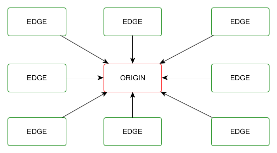
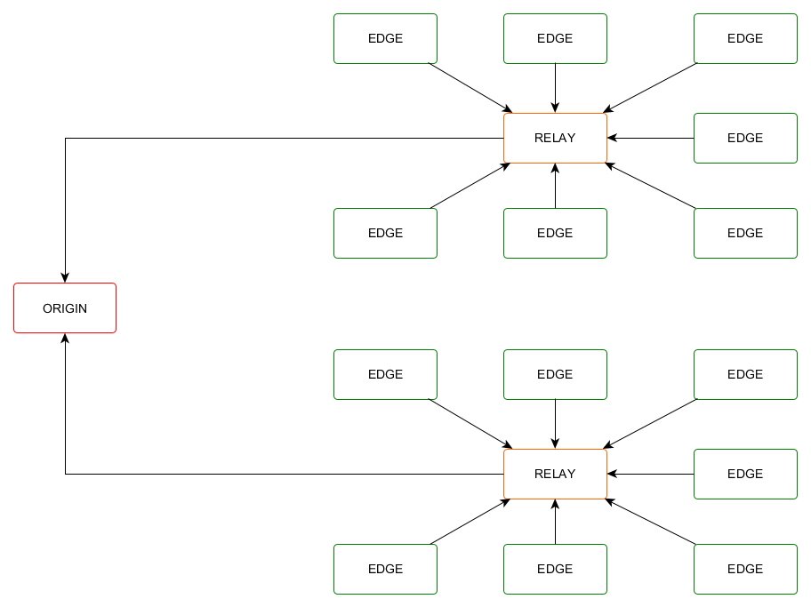
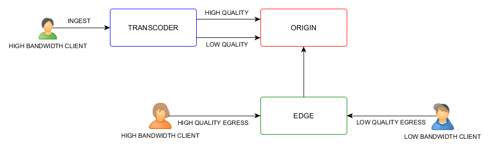

# Maximize Scaling with Relays & Transcoders

## Introduction

Autoscaling has always been the center of gravity for cloud business that requires dynamic scaling capabilities for their dynamic needs. With Red5 Pro autoscaling we have 

What about even larger businesses with even larger infrastructures that require hundreds and thousands of servers in a cluster relaying streams from publishers to subscribers with unpredictable network speeds across continents.

## Relays

### Stressed out origins

With such a use case, we realized the bottleneck of a simple **origin-edge** cluster. One could connect only so many edges an origin before the origin got stressed-out, thereby reducing true scalability for extra large systems.

For sake of discussion, let us assume a system, where we need to support `100,000` subscribers for a ingest stream. The capacity of each edge is about `100` and the origin capacity is about `50`. Each publisher connected to the origin reduces the capacity by stresses other resources such as CPU, Memory etc. Adding an edge to the origin creates a path for subscription and at the same time reduces the original capacity even further. Eventually, we reach a point where the origin capacity is at its last breath and we need to add more edges to support more subscribers but that's not possible anymore.

### Along came relays

To provide a solution to the problem discussed above and to alleviate restreaming stress from the origin, **Relays** were introduced as a part of **Red5 Pro Autoscaling v3**. Relays are streaming nodes that sit in between origins and edges for the sole purpose of making restreaming scalable. Relays **pull** stream from the origin for restreaming  & edges connect to relays to **pull** streams for the subscription. In orher words `relays` are restreamer delegates for origins. In terms of Red5 Pro autoscaling, we call clusters with `relays` as `Tier 2` node groups.

**Diagram 1 : Tier 1 Node Groups (Low scalability)**

**Diagram 2 : Tier 2 Node Groups (High scalability)**

So going back to the problem mentioned earlier, we can redesign the system by adding relays to origins and then connects multiple edges to the relays. This way the `stress at the origin` is minimized as we require fewer relays and we maximize egress capacity since we can easily expand the number of edges by simply adding relays in steps.

This kind of scaling strategy coupled with Red5 autoscaling ensures that you can now defy limits and build a system with very high scalability.

**Reducing bandwidth costs**

Another interesting yet effective use of relays can be seen in bandwidth cost optimization. Consider a use case where the publishing starts in Asia, ie the origin resides in Asia and some of the subscribers will be in Asia and some in the North America. Now if `each` edges in the North America need to pull the stream from the origin in Asia the bandwidth cost will rise accordingly. However, if you use one relay to pull the stream from Asia into the North America region and then connect edges in United to that relay, you will be effectively cutting down cross-continent delivery costs as well as making the system more efficient.

## Transcoders

### One size does not fit all

The other major problem in building scaling streaming systems, which is not limited to the actual size of the streaming architecture, is the ability to cater users with different bandwidths across the globe. A high-quality high bitrate stream will easily choke subscribers lower bandwidths. Some will not be playable at all, whereas some will have the worst user experience ever.

So the obvious question to summarize our problems would be - "if there are countries with different average internet speeds, and people in those countries use different devices having different internet speeds, then how can we ensure that every customer has a good streaming experience ?".

### Making sure everyone is happy

To solve the problem to matching a  high bandwidth ingest with different kind of subscribers, we introduced **transcoders** nodes. **Transcoders** are not a part of the regular clustering mechanism. Rather they are floating nodes that can be thought of as a desktop encoder software such as Flash media lives encoder or Open Broadcaster Software etc.

With transcoder in place, the ingest goes to the transcoder nodes instead of origins. The transcoder nodes create multivariate streams (Different quality variations of the ingest) for subscriptions. From here on the clients can consume the appropriate version of the stream as per their bandwidth through various **Red5 Pro client SDK offerings** based on the protocol used for stream consumption.

The process of configuring multivariate streams is called **Provisioning**, where you define the different output qualities for your ingest. You can configure **multiple** outputs for a single ingest using the provisioning API. For information on provisioning take a look at our [Stream Manager provisioning API](https://www.red5pro.com/docs/autoscale/smapi-streamprovision) and the [Read stream API](https://www.red5pro.com/docs/autoscale/smapi-streams#read-stream) for information on requesting a transcoder for your ingest.

## Conclusion & Summary

True scaling of a streaming system happens when it is able to scale out by **capacity**, growing vertically to meet the demands of its ever growing traffic while at the same time growing horizontally to make sure every type of client, by bandwidth, by protocol and by location is cared for in an appriate manner such that it can gurantee a single unified user experience across the entire system.

Finally before i conclude, here are few points to highlight, regarding the latest Red5 Pro autoscaling additions - `Relays & Transcoders`.

* Relays are necessary for building very large scale architectures.

* Relays can be very useful in saving bandwidth costs for cross-continent streaming scenarios

* Transcoders can be used with (Tier 2 groups) or without relays (Tier 1 groups).

* Transcoding can be used for small, medium and large scale systems to enhance user experience.

* Transcoding is not available with standalone Red5 Pro instances. They are available only as a part of the Red5 Pro autoscaling. Thus to make use of `transcoding`, you should ensure that your license is applicable to Red5 Pro autosclaing.

If you need more information on relays and transcoders, please contact support to schedule a business call with us for further clarifications.