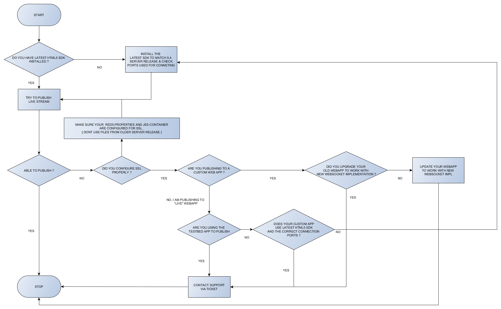

# Red5 Pro 5.4 Upgrade Troubleshooter

## Introduction

The latest version of Red5 Pro (5.4) brings a major change to the Red5 Pro ecosystem. The WebSocket service now flows through the standard HTTP and https ports. Therefore there is no need to have separate ports - 8081 and 8083 opened for the same. This also means that custom WebSocket or webrtc applications previously built will break on the new server. This little guide aims to help you understand the changes and adapt your custom web app accordingly.

## What has changed

* WebSockets now use HTTP and HTTPs ports instead of separate WS and WSS ports in prior versions
* The WebSocket plugin used in previous versions is removed and we have switched to a more standardized `tomcatplugin`. Reference: [https://mvnrepository.com/artifact/org.red5/tomcatplugin](https://mvnrepository.com/artifact/org.red5/tomcatplugin)
* A special web socket filter needs to be included in the web apps that need to support WebRTC or even plain WebSockets.

## Troubleshooter flow chart

## What You should not do

* Upgrade your server as with previous versions carrying over some configuration files from old server into new

## What You need to do

* Configure the `red5.properties` and `jee-container.xml` files for SSL fresh from the 5.4 build
* Don't put your old web app into the new server without making it compatible with new WebSockets implementation
* In your firewall settings, make sure `http port` - `5080` and `https port` - `443` are allowed.
* Take a look at this [github sample application](https://github.com/rajdeeprath/red5-development-series/tree/master/code-examples/server-side/red5-application-examples/simple-webrtc-streamer) which is compatible with both open source Red5 (for Websockets) and Red5 Pro (for Websockets / WebRTC)

> Note do not copy the entire pom.xml of the sample webapp.Just ensure you have the Websocket scope initialization code in your webapp and the tomcat plugin is referenced in pom.xml along with the wsfilter in the web.xml.

* Additionally i recommeend that you check out the **updated** official Red5 Pro app dvelopment series by [Dominick on the topic](https://www.red5pro.com/docs/developerseries/04/example.html).
